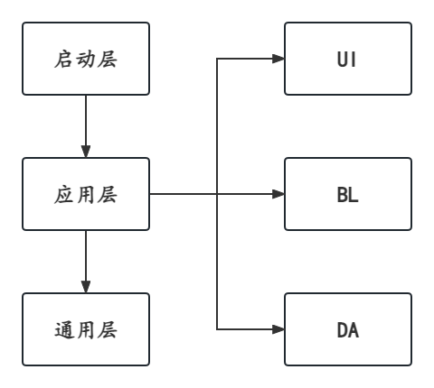

# Layers and Aggregation

最近在升级改造项目，而这些项目除了技术栈不同之外，所采用的架构模式基本上都是一致的，emm，有点想法。

## 案例

以一个常规的 React 项目的**第一层**源码目录为例。

首先将其分为 3 大层级：

- 启动层，启动之前需加载必备依赖，为通用层和应用层提供运行支柱；
- 通用层，将服务于应用层；
- 应用层，业务实现层。

另，通用层与应用层可一同归纳为运行过程。

其中，应用层又可以细分成众所周知的 MVC/MVVM 架构：

- views: 表现层
- stores: 数据访问层
- services: 业务逻辑层

```tree
src
# 启动层
├─ App.tsx
├─ main.tsx
├─ polyfill.ts
├─ react-app-env.d.ts

# 应用层
├─ views                  # 表现层
├─ stores                 # 数据访问层
├─ services               # 业务逻辑层

# 通用层
├─ types
├─ utils
├─ hooks
├─ styles
├─ constants
└─ components
```

如图所示：



那么这样划分的意义在哪里？又会不会有什么弊端呢？

## 分层架构

分层架构是一个常用的、优秀的软件架构设计理念，它无处不在。

实际上，我们在学习前端开发之初就蕴涵了这一思想：**「结构、表现、行为」相分离**。

```tree
src
├─ index.js
├─ index.css
└─ index.html
```

问题发散：

1. 分层分的是什么层？
2. 具体又应该如何实现（体现）？

由案例可得：**分层分的是抽象层级**。

[抽象](https://baike.baidu.com/item/%E6%8A%BD%E8%B1%A1/9021828)（abstract）是从众多的事物中抽取出共同的、本质性的特征，而舍弃其非本质特征的过程。

### 分的是抽象层级

### 体现在调用层面

## 聚合架构

虽物以类聚人以群分（具象化，同一类事物），但分层分的是抽象化事物，应该体现在“调用”层面，而不是表现层面（形式主义）。

框架提供基础设施之外，还应具备最佳实践。

分层架构走了岔路，应该叫分文件夹架构，嵌套尤为明显
