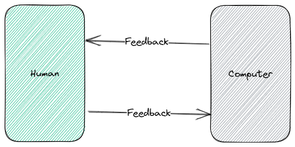
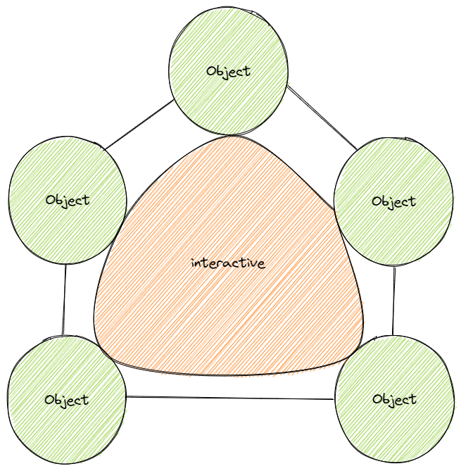
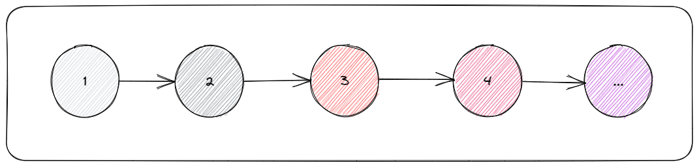
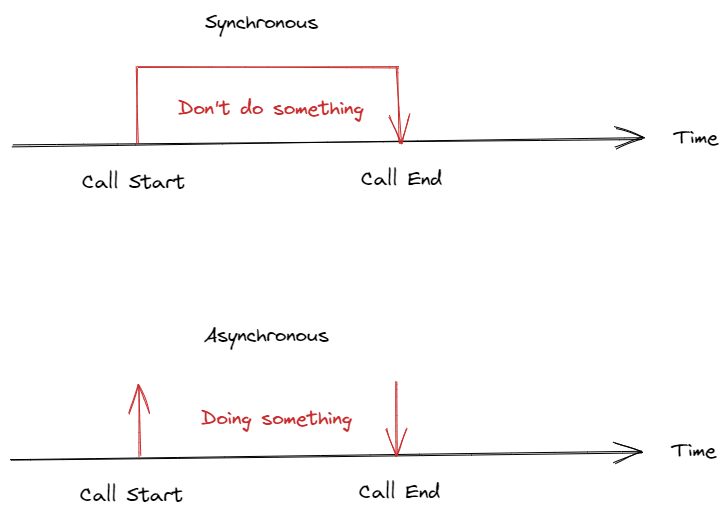
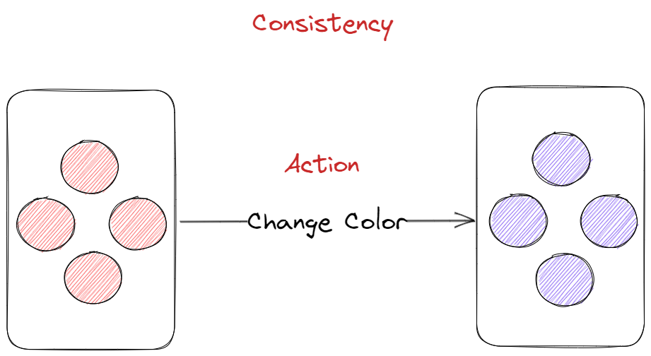

# First Principle Thinking

第一性原理（First Principle Thinking，FPT）这个词，首次见到是在一本 Haskell PDF 书（[Haskell Programming From First Principles](https://haskellbook.com/)）的书名上。

一开始还不是很理解，直接从 First Class Function 这类词上套用了共性，单纯的理解为作者是想表达 Haskell 的基本原理，即语言的语法和构造这层含义。

今天在整理资料的过程中发现，原来它是有一个专有的定理名词，并且我们在日常的生活、工作中，也会潜移默化地运用这一定理。当然，语言、知识、概念、公理，本质上都是针对某一现象的概括性总结，除非是专门研究这类事物的专家，否则我们作为常人，不了解也实属正常。

那么，什么是第一性原理呢？

在每个系统探索中都存在第一性原理。第一性原理是基本的命题和假设，不能被省略和删除，也不能被违反。

说人话，就是用逆推法追根溯源，从眼前要解决的问题开始，分析产生这个问题的原因，再分析产生这个问题的原因的原因，一直推导至根源不证自明的元起点。即：

1. 透过现象看本质；
2. 不要急于模仿与套用；
3. 打破规则，需要跳出已有的逻辑；
4. 从更基础的原理，更本质的规律，更指向结果的方向去思考事物，有助于我们创新。

所以，在后续的探索过程中，我们会对很多概念进行研讨，相互论证，从具象反推到抽象，反之亦然，因为其中的部分概念是支撑现有的软件设计与开发的基础。

## 统一语言

在研讨某个话题之前，参与者之间需达成某种共识，也就是统一语言。

为什么要统一语言？统一什么语言？

沟通是语言（Language）的本质用途。在这里，语言不是特指人类的自然语言，也不是计算机的编程语言，而是某个领域（Domain）中的知识概念。通常，在进入某个领域之前，要做的第一件事便是了解清楚该领域相关的知识概念（俗称黑话）。

因为一个词或一段表述，在同一个领域或不同的领域中，可能会有不同的含义；反之，一个含义也可以用不同的词或表述来表示。因此，为了避免出现沟通上或理解上的歧义，我们需要对某些知识进行提炼，定义并建立一个专属于该领域的术语表，也叫通用语言（Ubiquitous Language）。乃至于我们在谈论某个概念时，能够达成共识；亦或是当新成员参与进来时能够快速且精准的理解某个概念的含义。

前人在经过长期的经验总结后，他们意识到在对业务知识梳理的过程中，必然会形成某种领域知识，因此只需要根据领域知识便可一步步地驱动软件的设计与开发。这就是领域驱动设计（Domain-Driven Design，DDD），统一语言是在进行业务建模之前要做的第一件事，同时也会强调「命名」的重要性。

这会，我们站在了巨人的肩膀上编程，将前人优秀的思想设计作为我们的灯塔，引领我们航行。

## 人机交互

前端的本质目标是实现人机交互（Human-Computer Interaction，HCI）。

[](https://excalidraw.com/#json=ZTSuc3OPv6FIzMEcK6xwf,S12wOVZqMxW0IeOUUPHjfg)

什么是交互？

在计算机的世界中，交互是指参与活动的对象之间可以相互交流、作用、影响。

我们知道，类就是对客观事物的抽象，它封装了事物的数据和行为，而对象则是类的具象化表现，即实例。

因此，从编程的角度来说，交互就是指程序间的数据交换和方法调用。

[](https://excalidraw.com/#json=jT_hi5lQwmnpUMxkE5yF8,qTLSdy22UToE5C4VHwdRvg)

## 数据、变量、状态

数据是事物归纳的结果，也叫做值，行为本质上也属于数据。

变量是记录数据的载体，在「非函数式编程」中，一个变量可以在不同时刻承载不同的数据，但最终只能保留当前时刻下的数据。

状态是在连续时间内变化的值（或变值的行为），即在变量的基础上赋予了时间概念，描述某个时刻下某个变量所承载的数据快照，建立一个在时间维度上的值数组（甚至可以理解为，数组的索引就代表了时间）。

[](https://excalidraw.com/#json=dnR97RKI5YV5zKvjMN89k,eqvqNTybR6nhLGhMVYmz9Q)

```ts
// 初始时刻
let variable = 1

// 时刻 1
variable = 2

// 时刻 2
variable = 3

// 时刻 3
variable = 4

// 时刻 ...
variable = '...'
```

例如，字面量`1 / 2 / 3 / 4`就是数据，包裹它们的圆圈就是一个变量，整个框就代表一个状态，记录着随时间变化的值。

需要注意的是：时间递延，数据不一定发生变化；数据变化了，时间就一定递延了。

_有很多单词可以表示状态这个含义，例如 Atom、State、Signal、Reactive、Behavior 等。_

## 同步、调度、管理

同步（Synchronous）在不同的语境下有不同的含义：

1. 譬如在代码执行的语境下，同步指的是从发起调用开始，直到收到调用结果为止，这一整个过程不间断地进行，强调「过程」这一概念。

   [](https://excalidraw.com/#json=MbCwPqU5t79uwZkEF4ivG,bwB4LvhR03WngPVKU1_yHQ)

2. 再如在系统运作的场景中，同步指的是对系统内所发生的事件（动作）进行统一协调，使得系统中的各个部件的状态最终保持一致，强调「动作」以及「一致性」这两个概念。

   [](https://excalidraw.com/#json=PBNJD-e2QMDnG_7s57xyc,4mrzFsZhAiRzYLJ7-4Gyjw)

那么，什么是管理（Management）呢？一直以来都没有好好思考过这个词的含义，潜意识的只是按照字面意思，认为管理就是维护、约束。

不仅限于此，管理是指一定组织中的管理者，通过实施计划、组织、领导、协调、控制等职能来协调他人的活动，使别人同自己一起实现既定目标的活动过程。

即，通过某种手段，控制外部的行为，使其与己协同工作。

在现实中，这是人类在进行各种组织工作中最普通和最重要的一种活动。

而在计算机的世界中，这个某种手段，指的就是调度（Dispatch），协同亦是同步。

## 总结

由人机交互的本质，拆解出数据和行为。对数据进行演变以满足不同的需求，一个系统的构造往往还会包含很多因素，为了使其能够正常工作，怎么对这些因素合理的进行把控也是重中之重。

## 参考资料

[什么是第一性原理，它有什么重要意义？](https://www.zhihu.com/question/21459243/answer/2383021728)
