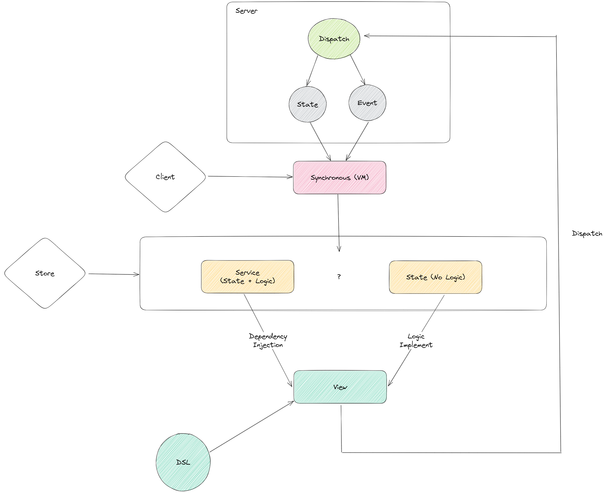

# State Management

状态管理这个东西，舌根都咀烂了，还在嚼，仿佛是个绕不过去的坎。

本文将以 React 为例，抛开已有的事实，推导可行的状态同步解决方案，一路追溯到状态管理的由来。

最后再研讨，我们需要的是「状态管理库」还是「状态管理」本身？以及在未来又该如何演变？

## 统一语言

老规矩，先统一语言：状态同步。

回想前一章节所定义的术语表，本文将采用一致性这个定义，即在一个完整的系统内外，各个部件中的状态最终能表现一致。

一个传统的 Web 应用系统，一般包含客户端与服务端。将其代入到 React 应用中，状态同步会涉及两个部分，即外部同步与内部同步，其也有对应的解决方案：

- 采用事件驱动，介入 React 的调度，将外部数据的变化同步到 React 应用。
- 建立单一数据源，使 React 内的各个组件能共享同一个状态的变化。

[](https://excalidraw.com/#json=0VlDPvAB4s1KUr0jrKelG,kvKXF063iAhZFeAJtTvMTA)

## 第一印象

在 React 中，通常有 3 种因素会引起组件重渲染，即 Props、State、Context 中的任意状态发生变更。

```ts
function Example(props) {
  const context = useContext(xxx)

  const [state, setState] = useState(xxx)
}
```

当然，触发组件重渲染的本质都是调用了`setState`而导致的，而`setState`的内部定义就是`dispatch`，后文还会介绍另外一种特殊的因素（总共就是 4 种因素）。

那么，是否可以将外部的数据直接通过`Props/Context`传递给组件？

例如，构造工厂：

```ts
class LauncherSDK {
  value = 0
}

function createWidget(jsxFactory: (props: LauncherSDK) => ReactJSX) {
  // 或使用依赖注入解除对依赖的直接耦合
  const instance = new LauncherSDK()

  // --------------- 差点什么？ ---------------

  return () => jsxFactory(instance)
}
```

调用方式：

```tsx
function Example(props: LauncherSDK) {
  return <h1>{props.value}</h1>
}

const FinallyExample = createWidget(Example)
```

细嗦上面的例子，有没有很像什么？

```tsx
import { connect } from 'react-redux'

const mapStateToProps = (state: LauncherSDK) => ({ value: state.value })

function Example(props: LauncherSDK) {
  return <h1>{props.value}</h1>
}

export default connect(mapStateToProps)(Example)
```

没错，就是 Redux 的模样。。。

只不过相比较于 Redux 之下，在构造工厂的例子中，我们似乎还差点什么？

还缺少，当外部数据发生变化时，能同步（通知）到 React 应用的能力，也叫响应能力。

## 惯用手法

### 同步 - 外部状态

由于外部数据的变更行为并不在 React 的管辖范围内，即它属于副作用。对于 React 来说副作用就是一个黑盒子，React 无法感知到外部数据现在处于什么状况，这也就意味着 React 没有办法自动（主动捕获）处理副作用。「**伏笔**」

于是，需要我们开发者对副作用进行「显式」处理，将其与 React 的纯函数组件进行交互连接，即接入到 React 的调度中：

```ts
const [state, setState] = useState(() => store.state)

useEffect(() => store.subscribe((v) => setState(v)), [])
```

也就是说，我们只需要在`createWidget`中加入类似这样一段处理副作用、触发 React 调度的逻辑，即可达到「同步外部状态」的目的。

而这也是我们在不使用状态管理库的前提下，惯用的做法。试想一下发送一个 http 请求，当请求响应时设置数据并触发更新，此类操作须在 effect 中处理。

> 为何需要在 effect 中处理？

### 内部 - 状态同步

此状态同步即状态共享，只需设置一个全局的数据源、或是状态提升、或是封装成服务，依赖注入即可。

### 小结

在前面的两个标题中，我故意对词组做了划分，因为「同步 - 外部状态」强调的是同步这个动作，而「内部 - 状态同步」强调的是结果的一致性。

## 设计权衡

得益于`Fiber`的应用，在 React 18 中，实现了并发特性，即一次渲染可能会被分为好几个部分并发执行（一个`Fiber`可视为一个部分）。

例如，在一次渲染中被分为了`A`和`B`两部分，时序如下：

1. `A`和`B`同时读取了一个外部数据源（注意是读取而不是订阅）
2. `A`渲染完成
3. 外部数据源修改了数据（此时`A`的渲染结果是无意义的，值是旧的）
4. `B`渲染完成（此时`B`的渲染结果是有意义的，值是新的）

这个造成同一次渲染中各个部分的结果却不一致的问题，被称为撕裂（Tearing）。

为此，React 18 提供了一个新的 Hook 来解决：`useSyncExternalStore`，即「同步外部数据源」。

`useSyncExternalStore`的前身是`useMutableSource`，叫「订阅外部数据源」。

为什么改名（重新设计）了呢？`useMutableSource`有配套的`createMutableSource`，类似`useContext/createContext`，同时它也不符合并发模式下的渲染逻辑。

在并发渲染中，`useSyncExternalStore`所能做的仅仅是同步刷新视图。也就是当感知（订阅）到外部数据源发生变更时，之前的部分渲染结果作废，整个渲染任务全部丢弃，同时将渲染模式转变为同步模式。即本次渲染不能再应用并发特性，从头开始直到渲染完成。而在同步模式下则有可能会阻塞浏览器渲染（取决于代码实现），引发性能问题。

> `useSyncExternalStore`本质上也是基于`useEffect`的封装。

`useSyncExternalStore`

```ts
// subscribe 用来收集当前订阅了数据源的节点（Fiber）
const state = 0
const listeners = []

// 收集订阅者
const subscribe = (fiber) => {
  listeners.push(fiber)

  return () => listeners.filter((v) => v !== fiber)
}

// 更新状态 + 通知更新
const updateState = () => {
  state++

  listeners.forEach((v) => v())
}

const externalState = useSyncExternalStore(subscribe, () => state)
```

因此，这也是能引发组件重渲染的另一种因素。

## 追根溯源

[](https://excalidraw.com/#json=FulCV3diKuGCEpYtJbCox,Qdf2fy4eWNgurDzEatsx6A)

梳理一下运作过程：服务端（Server），需提供状态（数据类型）与事件（接口）。使得客户端能够对其发起订阅（请求）。而对于不同的服务端模型，可能需要额外提供一个`Dispatcher`，赋予客户端能够主动发起变更的权力，最后服务端再通过事件将变更结果推送回客户端，形成环路。

一路推导至此，熟悉的朋友可能会发现，此模式跟 [Flux](https://facebook.github.io/flux/docs/in-depth-overview/) 的架构基本一致：


而且需要注意的是，Flux 作为状态管理的鼻祖，[Store](https://facebook.github.io/flux/docs/in-depth-overview/#stores) 层是依据面向对象而下的定义：**Stores contain the application state and logic**。

翻译过来就是，模型层应当包含领域（领域亦是业务）的状态和逻辑。领域的数据不应当与行为分离，即面向对象编程，应用充血模型。

Redux 推崇数据与行为分离（对应贫血模型），这是因为它贯彻的是函数式理念，要求数据不可变，行为纯粹，这也是它在描述架构时与 Flux 等一众状态管理库最大的不同。

由于函数式编程中没有变量（可变）这个概念，因此在每次的函数调用时，函数参数都将是一个不同的实例，而函数本身也可能作为参数传递，也就意味着，函数也是状态。

在 JS 中缺乏了太多的函数式特性，例如不变性、模式匹配等。虽然可以通过模拟、绕弯等 Hack 的方式在 JS 层面实现某些特性，但终究是杯水车薪，譬如 Redux 的类型以及样板代码会随着业务复杂度的上升而暴增等问题随之映现。

所以它们之间本质上只是理念，甚至是学术界与工业界之间的碰撞。

## 再度演变

经过思考与实践发现，状态管理本来一整个模型层应当包含完整的数据和行为，逐渐演变成就只存储数据及其 getter/setter，行为不知所踪，分层架构演变为了“分文件夹架构”。

当然，或许是因为「状态管理」这个名词过度的强调了「状态」两个字，但就抽象共性而言，行为也属于数据，这便要强调统一语言的重要性了。

因此，所浮现出来的问题不仅仅是代码层面，除了前文提到的类型与样板代码问题之外，还有：

1. 业务交互（Model）与视图交互（View）耦合，即抽象层次未划分。
2. 数据与行为乃是平行关系，在视图层实现业务逻辑需要反向依赖数据。

构成一个模块所需的元素零散在各地，不利于复用与维护，并且直接扼杀了移植的可能性。

## 伏笔埋坑

回到上文提到的一个「伏笔」，结合这一整个流程，如果走图中的 Service 分支，就会发现这一套架构模式，就是 Angular 的架构。

之前有提到，React 无法主动处理副作用，因为它不知道这个黑盒到底「做了什么」，需要开发者手动介入 React 的调度。

而 Angular 不同，它不需要知道你到底做了什么，它只需要知道你到底「做了没有」。也就是说数据的改变都会有一个缘由，不管是手动触发，还是定时器未来自动触发，本质上都是基于事件回调机制（异步）。

于是 Angular 实现了 Zone，暴力劫持浏览器的各类异步事件、任务。当事件触发时，全局范围内保守式地检查所有组件所用到的状态是否发生了变化，若变化则标记为脏，以便后续执行重渲染流程，宁可错杀一千不可放过一个。相应的也需要付出代价：在运行时进行脏检测会有性能问题。

最后，Angular 还提供了一套依赖注入机制，便于当业务交互与视图交互解耦时能通过某种手段再次进行连接，或根据实际情况应用单例或多例模式。

所以，在 Angular 的应用中并不推崇状态管理，因为由于面向对象的存在，状态可依托于服务。

## 参考资料

- [Hooks 数据行为分离](https://zhuanlan.zhihu.com/p/431955384)
- [What is tearing?](https://github.com/reactwg/react-18/discussions/69)
- [Concurrent React for Library Maintainers](https://github.com/reactwg/react-18/discussions/70)
- [useMutableSource → useSyncExternalStore](https://github.com/reactwg/react-18/discussions/86)
- [如何理解 React 18 中的 useSyncExternalStore ?](https://www.zhihu.com/question/502917860/answer/2252338680)
