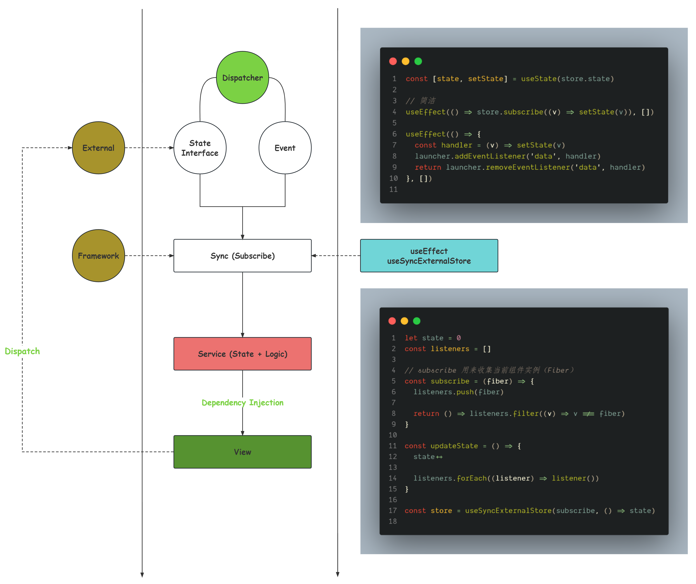
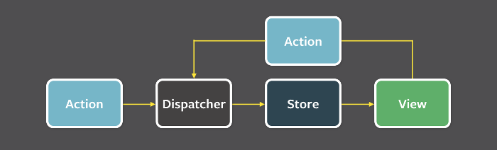

# 状态同步

## 统一语言

同步指的是处处一致，有两层含义及其对应的解决方案：

- 将外部数据的变化同步到消费端，需采用事件驱动。
- 消费者共享同一个状态的变化，需建立单一数据源。

## 初期思路

在 React 中，通常有 3 种因素会引起组件重渲染：Props、State、Context 中的任意状态发生变更：

```ts
function Example(props) {
  const context = useContext(xxx)

  const [state, setState] = useState(xxx)
}
```

那么，是否可以将外部的状态直接通过`Props/Context`传递给组件？

例如，构造工厂：

```ts
class LauncherSDK {
  value = 0
}

function createWidget(jsxFactory: (props: LauncherSDK) => ReactJSX) {
  // 或使用依赖注入解除依赖的直接耦合
  const instance = new LauncherSDK()

  return () => jsxFactory(instance)
}
```

调用方式：

```tsx
function Example(props: LauncherSDK) {
  return <h1>{props.value}</h1>
}

const FinallyExample = createWidget(Example)

// 美化一下：
const FinallyExample = createWidget((props) => <h1>{props.value}</h1>)
```

细看上面的例子，有没有很像什么？

```tsx
import { connect } from 'react-redux'

const mapStateToProps = (state: LauncherSDK) => ({ value: state.value })

function Example(props: LauncherSDK) {
  return <h1>{props.value}</h1>
}

export default connect(mapStateToProps)(Example)
```

没错，就是 Redux。。。

### 解决方案

由于外部的数据以及变更动作不在 React 的调度范围内，即这类副作用对于 React 来说是一个黑盒子，它无法感知到外部数据现在是什么情况，这也就意味着 React 没有办法自动（主动捕获）去处理。「**伏笔**」

于是，需要我们开发者「显式地」处理这些副作用，并且需要接入到 React 的调度中，即：

```ts
const [state, setState] = useState(() => store.state)

useEffect(() => store.subscribe((v) => setState(v)), [])
```

也就是说，我们只需要在`createWidget`中加入类似这样一段处理副作用的逻辑，即可达到「同步外部状态」的目的。

至于「状态共享」就很简单了，设置一个全局的 Store，依赖注入即可。

## 权衡其它方案

得益于`Fiber`的应用，在`React 18`中，实现了并发特性，即一次渲染可能会被分为好几个部分一起执行（一个`Fiber`即一个部分）。

例如，在一次渲染中被分为了`A`和`B`两部分，时序如下：

1. `A`和`B`同时读取了一个外部数据源（注意是读取而不是订阅）
2. `A`渲染完成
3. 外部数据源修改了数据（此时`A`的渲染结果是无意义的，值是旧的）
4. `B`渲染完成（此时`B`的渲染结果是有意义的，值是新的）

这个造成同一次渲染中各个部分的结果却不一致的问题，被称为「撕裂（Tearing）」。

为此，`React 18`则提供了一个新的`Hook`来解决：`useSyncExternalStore`，即「同步外部数据源」。

`useSyncExternalStore`的前身是`useMutableSource`，叫「订阅外部数据源」。

为什么改名（重新设计）了呢？`useMutableSource`有配套的`createMutableSource`，类似`useContext/createContext`，同时它也不符合并发模式下的渲染逻辑。

在并发渲染中，`useSyncExternalStore`所能做的只是同步刷新视图。即在外部数据源发生变更时，之前的部分渲染结果作废，整个渲染任务全部丢弃，同时转变为同步模式，从头开始，即本次渲染不能再应用并发特性，而在同步模式下有可能会阻塞浏览器渲染，有性能问题。

> `useSyncExternalStore`本质上也是基于`useEffect`的封装。

`useSyncExternalStore`

```ts
// subscribe 用来收集当前组件实例（Fiber）
const state = 0
const listeners = []

const subscribe = (fiber) => {
  listeners.push(fiber)

  return () => listeners.filter((v) => v !== fiber)
}

const updateState = () => {
  state++

  listeners.forEach((v) => v())
}

const externalState = useSyncExternalStore(subscribe, () => state)
```

### 相关资料

- [What is tearing?](https://github.com/reactwg/react-18/discussions/69)
- [Concurrent React for Library Maintainers](https://github.com/reactwg/react-18/discussions/70)
- [useMutableSource → useSyncExternalStore](https://github.com/reactwg/react-18/discussions/86)
- [如何理解 React 18 中的 useSyncExternalStore ?](https://www.zhihu.com/question/502917860/answer/2252338680)

## 完整流程



外部（External）与消费端（Framework）：

首先，需提供事件类型（Event）及其对应的数据模型定义（State Interface），用于消费端发起订阅，定制消费逻辑。

其次，还需提供触发该事件的方法（Dispatcher），用于消费端主动变更外部数据，然后外部再通过事件流将变化后的数据同步回消费端，形成环路。

到这里就会发现，此模式跟 Flux 的模式基本一致：



然而不同的是，视图不能直接消费订阅而来的数据，因为一旦直接对数据进行消费，就会：

1. 丧失了对逻辑的封装能力，即 Model 成为一个贫血模型，其行为（逻辑）分散在视图各地，无法复用或移植，且不利于测试。
2. 逻辑过度依赖数据，换句话说逻辑会依赖视图是如何的表现，没有数据定义就无法进行逻辑处理，而视图是实现细节，是极其不稳定的。

综上，需将状态和逻辑封装成服务，根据实际情况应用单例或者多例，再提供给视图消费。

回到上文提到的一个「伏笔」，结合这一整个流程，会发现这一套架构模式，就是 Angular 的架构。

之前有提到，React 无法主动处理副作用，因为它不知道这个黑盒到底「做了什么」，需要开发者手动介入 React 的调度。

而 Angular 不同，它不需要知道你到底做了什么，它只需要知道你到底「做了没有」。也就是说数据的改变都会有一个缘由，不管是手动触发，还是定时器未来自动触发，本质上都是基于事件回调机制（异步）。

于是 Angular 用 Zone 暴力劫持浏览器的各类异步事件、任务。当事件触发时，全局范围内保守式地检查所有组件所用到的状态是否发生了变化，若变化则标记为脏，用以后续执行重渲染流程。

相应的也需要付出代价：在运行时进行脏检测会有性能问题。

最后，Angular 还提供了一套依赖注入机制，用于将业务交互与视图交互解耦。

所以，在 Angular 的应用中不需要状态管理，状态依托于服务。
