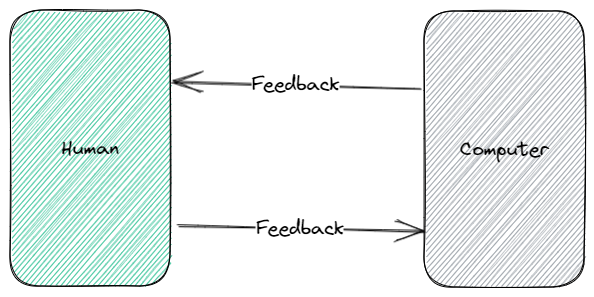
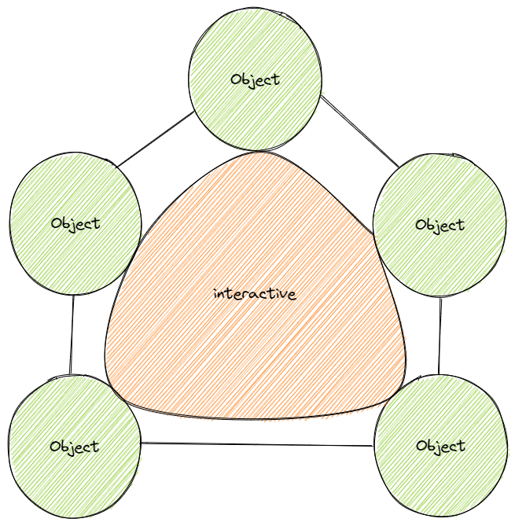
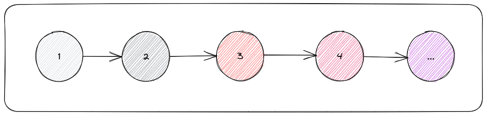

<style>
  img {
    margin: auto;
    display: block;
  }
</style>

# Functional Programming: Exploration Trips

## 统一语言

为什么要统一语言？统一什么语言？

语言（Language）的本质就是为了沟通。在这里，语言不是指人类的自然语言，也不是计算机的编程语言，而是领域（Domain）中的知识概念。

因为一个词或一段表述，在同一个领域或不同的领域中，可能会有不同的含义；反之，一个含义也可以用不同的词或表述来表示。

因此，为了避免出现沟通上或理解上的歧义，我们需要对某些知识进行提炼，定义并建立一个专属于该领域的术语表，也叫通用语言（Ubiquitous Language）。

乃至于我们在谈论某个概念时，能够达成共识；亦或是当新成员参与进来时能够快速且精准的理解某个概念的含义。

前人经过长期的经验总结，他们意识到在对业务知识梳理的过程中，必然会形成某种领域知识，因此只需要根据领域知识便可一步步地驱动软件的设计与开发。

这就是领域驱动设计（Domain-Driven Design，DDD），统一语言是在进行业务建模之前要做的第一件事，同时也会强调「命名」的重要性。

我们将站在巨人的肩膀上编程，运用优秀的思想设计，引领我们前行的方向。

### 人机交互

前端的本质是人机交互（Human-Computer Interaction，HCI）。

[](https://excalidraw.com/#json=ZTSuc3OPv6FIzMEcK6xwf,S12wOVZqMxW0IeOUUPHjfg)

什么是交互？

在计算机的世界中，交互是指参与活动的对象之间可以相互交流、作用、影响。

我们知道，类就是对客观事物的抽象，它封装了事物的数据和行为，而对象则是类的具象化表现，即实例。

因此，从编程的角度来说，交互就是指程序间的数据交换和方法调用。

[](https://excalidraw.com/#json=jT_hi5lQwmnpUMxkE5yF8,qTLSdy22UToE5C4VHwdRvg)

### 数据、变量、状态

数据是事物归纳的结果，在数学中叫做值，行为本质上也属于数据。

变量是记录数据的载体，在非函数式编程中，一个变量可以在不同时刻承载不同的数据，但最终只能保留当前时刻下的数据。

状态是在连续时间内变化的值（或变值的行为），即在变量的基础上赋予了时间概念，描述某个时刻下某个变量所承载的数据快照，建立一个在时间维度上的值数组。

[](https://excalidraw.com/#json=dnR97RKI5YV5zKvjMN89k,eqvqNTybR6nhLGhMVYmz9Q)

```ts
// 初始时刻
let variable = 1

// 时刻 1
variable = 2

// 时刻 2
variable = 3

// 时刻 3
variable = 4

// 时刻 ...
variable = '...'
```

例如，字面量`1 / 2 / 3 / 4`就是数据，包裹它们的圆圈就是一个变量，整个框就代表一个状态，记录着随时间变化的值。

需要注意的是：时间递延，数据不一定发生变化；数据变化了，时间就一定递延了。

_有很多单词可以表示状态这个含义，例如 Atom、State、Signal、Reactive、Behavior 等。同时在响应式编程中又被划分出不同的阵营，其各自的设计方案与实现又各有千秋，目前貌似还处于大乱斗时代。_

## 响应式编程

响应式，即应对某种行为自动做出相应的反应。例如当值发生变化时做某某事、当事件被触发时要做些什么。

> 它是隶属于声明式编程（Declarative Programming，DP）旗下的一个子范式。

同时，这类行为是属于未知的，因此本质上需要基于异步回调的机制去处理各类问题。

结合人机交互的本质，在响应式编程中，又被划分为了两大分支：数据驱动与事件驱动。

所谓驱动主体，是由流程的发起方决定。

### 数据驱动

数据驱动，即流程的发起由数据的变化而产生。

数据驱动的核心要素就是状态，状态是「判等」的唯一凭证，旨在当时间前后的数据不等时，要做出的某种反应。

```ts
if (!Object.is(oldValue, newValue)) dispatchProcess()
```

### 事件驱动

事件驱动，即流程的发起由事件被触发而产生。

事件驱动不在乎你做了什么，只在乎你做了没有。

你一做我就知道你要搞事，我就开始全局范围内保守式地检查所有数据（脏检测），宁可错杀一千不可放过一个。

```ts
const nativeAddEventListener = window.addEventListener

window.addEventListener = (type, handler) => {
  nativeAddEventListener(type, (e) => {
    handler(e)
    dispatchProcess()
  })
}
```
