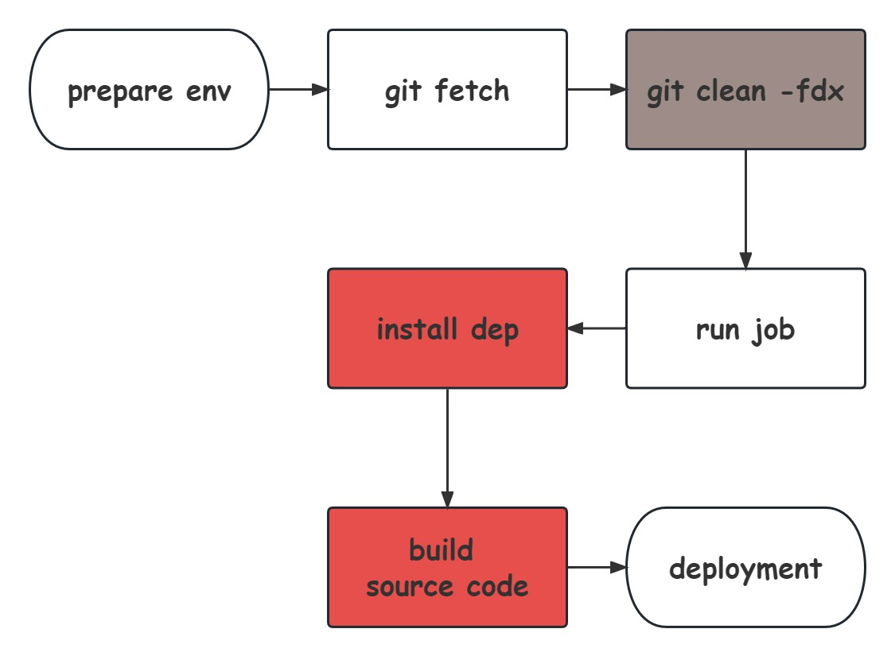
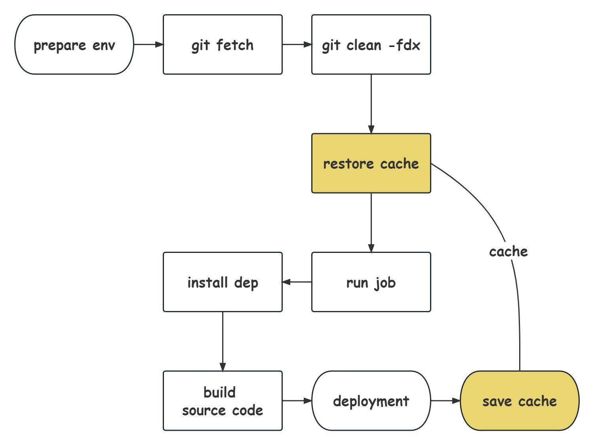

# 自动化运维工程

通常，我们在完成需求开发后，会将代码推送到远程仓库。根据 CI 配置，系统会自动触发 CI 流程。

在 GitLab 中，该自动化运维流程主要包括以下几个步骤：



在整个构建过程中，依赖安装阶段和构建阶段往往是比较耗时的环节。这是因为在 CI 环境中，为确保构建工作的正常进行与构建结果的正确性，GitLab 服务器会在每次执行 Job 之前执行一次 clean 操作，清空之前的构建结果和任何缓存，确保工作空间是干净的。

而关于`git clean -fdx`这行命令的作用则是清理未被追踪过文件和目录，其参数解释如下：

- `-f`：授权强制删除
- `-d`：递归删除目录
- `-x`：连带在`.gitignore`中标记的文件一起删除

其中，安装依赖阶段不仅耗费大量时间，并且每次都需要执行。因此，为了提高构建效率，我们应尽量减少依赖安装的时间，或者直接跳过此阶段。

至于构建阶段，现代构建工具能够输出并存储编译缓存，这为构建过程的加速提供了很大帮助，有效利用这些编译缓存进行增量构建是提高构建效率的重要手段之一。

## 缓存策略

缓存机制是提高构建效率的重要手段之一，我们可以对特定的文件夹进行缓存，例如`build_cache`和`node_modules`，其中`build_cache`文件夹的具体路径和名称可能因项目所使用的构建工具而异。

通过缓存这些文件夹，可以避免每次都重新构建和安装依赖，从而节省大量时间。

> 由于`cache`包含了`build_cache`和`node_modules`，以下我们统称缓存。

### 具体措施

为此，我们需要在流程中补充两项工作：

- 在<清理>工作完成之后<恢复>缓存
- 在<部署>工作完成之后<备份>缓存

相关配置如下：

```yaml
# .gitlab-ci.yml

cache:
  paths:
    - build_cache # 具体路径与名称自行替换
    - node_modules
```

新的工作流程：



### 另寻他路

此策略在普通项目中会是一个简单的方案，但在一些特殊的项目中并非完美：

1. monorepo
2. 大型 SSG 静态资源
3. 来回的重复删除解压缩
4. 阶段无用

## 我命由我不由天

## 总结

为了确保缓存的有效性和正确性，需要注意定期清理和更新缓存，以及避免缓存文件夹中包含与构建结果无关的文件。
