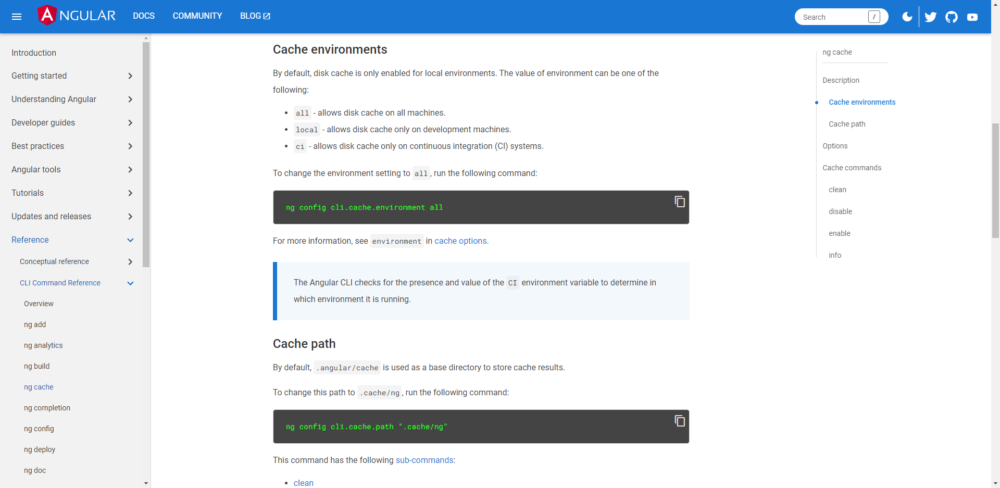
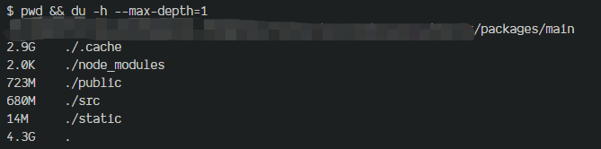

# 自动化运维工程

通常，我们在完成需求开发后，会将代码推送到远程仓库。根据 CI 配置，系统会自动触发 CI 流程。

在 GitLab 中，该自动化运维流程主要包括以下几个步骤：


在整个构建过程中，依赖安装阶段和构建阶段往往是比较耗时的环节。这是因为在 CI 环境中，为确保构建工作的正常进行与构建结果的正确性，GitLab 服务器会在每次执行 Job 之前执行一次 clean 操作，清空之前的构建结果和任何缓存，确保工作空间是干净的。

而关于`git clean -fdx`这行命令的作用则是清理未被追踪过文件和目录，其参数解释如下：

- `-f`：授权强制删除
- `-d`：递归删除目录
- `-x`：连带在`.gitignore`中标记的文件一起删除

其中，安装依赖阶段不仅耗费大量时间，并且每次都需要执行。因此，为了提高构建效率，我们应尽量减少依赖安装的时间，或者直接跳过此阶段。

至于构建阶段，现代构建工具能够输出并存储编译缓存，这为构建过程的加速提供了很大帮助，有效利用这些编译缓存进行增量构建是提高构建效率的重要手段之一。

## 缓存策略

缓存机制是提高构建效率的重要手段之一，我们可以对特定的文件进行缓存，例如`build_cache`和`node_modules`，其中`build_cache`文件夹的具体路径和名称可能因项目所使用的构建工具而异。

通过缓存这些文件，可以避免每次都重新开始安装依赖和构建，从而节省大量时间。

> 我们将项目中的`build_cache`或`node_modules`统称为工件（`Artifacts`），对工件做缓存。

### 具体措施

为此，我们需要在流程中补充两项工作：

- 在<清理>工作完成之后<恢复>缓存
- 在<部署>工作完成之后<备份>缓存

相关配置如下：

```yaml
# .gitlab-ci.yml

cache:
  paths:
    - build_cache # 具体路径与名称自行替换
    - node_modules
```

新的工作流程：


### 缓存策略的不足之处

尽管应用缓存策略可以在大多数项目中提高构建效率，但在一些特殊的项目中，它可能并非绝佳方案或需要额外的配置才能发挥作用。

#### monorepo

在 monorepo 项目中，每个子包都可能有自己的工件，如果只缓存项目根目录下的工件，由于缓存的缺失，包管理器或构建工具在进行工作时可能会重新开始而不是增量。

因此除了项目根目录下的工件需要缓存之外，子包内的工件也需要一起缓存。

```diff
cache:
  paths:
    - build_cache
    - node_modules
+   - packages/*/build_cache
+   - packages/*/node_modules
```

#### 性能浪费

如前文所说，每个 Job 在执行之前都会执行清理工作。

而在一些复杂的流程中，我们可能会将整个自动化流水线划分为多个阶段，每个阶段又会划分为多个 Job。这意味着缓存会频繁进行恢复与备份，虽然所需时间可能不多，但依然可能会对性能造成影响。

例如，在<部署>阶段，我们只需要上传构建后的产物，这些产物可通过配置`artifacts`属性作为临时缓存保留，以便在阶段之间传递。但除此之外，不可能会再用到缓存内的工件，因此执行备份与恢复缓存操作是对性能的一种浪费。

```yaml
stages:
  - build
  - deploy

build:
  stage: build
  script:
    - yarn build
  artifacts:
    paths:
      - dist
    expire_in: 6 hrs

deploy:
  stage: deploy
  script:
    - scp xxx xxx dist
```

最简单的解决方案便是在部署阶段禁用缓存功能。

```diff
stages:
  - build
  - deploy

build:
  stage: build
  script:
    - yarn build
  artifacts:
    paths:
      - dist
    expire_in: 6 hrs

deploy:
+ cache: []
  stage: deploy
  script:
    - scp xxx xxx dist
```

#### 默认行为

为确保 CI 环境中生成`build_cache`，请根据相应文档进行手动配置，因为部分框架的默认设置可能会禁用该功能。

例如，在 Angular 项目便默认不会在 CI 环境中生成编译缓存：



需要手动开启：

```json
// angular.json

{
  "cli": {
    "cache": {
      "environment": "all"
    }
  }
}
```

#### 静态资源项目

静态资源项目通常用于门户网站和企业官网等需要频繁更新内容但不需要复杂交互功能的网站。它通过使用静态站点生成器（SSG）获取业务数据并编译为静态的 HTML 文件，以提高网站的响应速度和用户访问体验。

随着时间的推移，静态资源会越来越多，这种项目也会变得越来越庞大。为了提高项目的构建速度，通常会对编译结果进行缓存，以进行增量构建。

一个大型的静态资源网站可能包含数千个页面，总体积达到几 GB 甚至十几 GB，而其编译缓存的体积也是相当巨大的。

譬如，我们公司某个业务线的官网项目（monorepo），使用`Gatsby`构建，其编译缓存（`.cache`）与公共资源（`public`）加起来达到了 3.5GB 的地步，这还只是该项目中某个子包。



而在 CI 环境中，如若对这种体积庞大的`build_cache`进行缓存备份与恢复，这个过程无疑会占据整个构建流程一定的时间比例。

## 我命由我不由天

## 总结

为了确保缓存的有效性和正确性，需要注意定期清理和更新缓存，以及避免缓存文件夹中包含与构建结果无关的文件。
