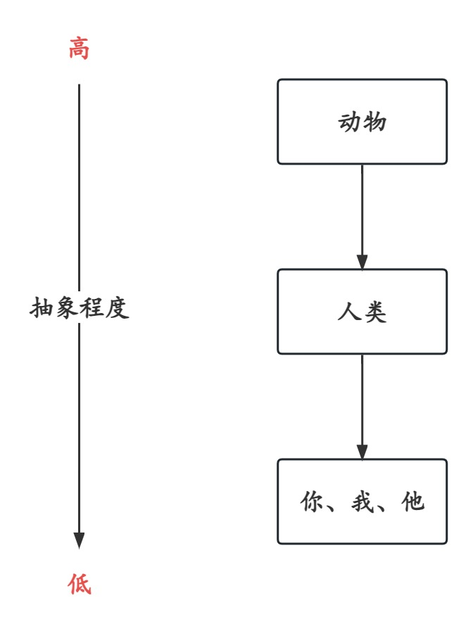

# 模块化思维模式

实际上，模块化的开发思想可能一直存在于每一位程序员的意识中，但在实际开发中，可能并没有完全遵循一些所谓的方法论，或者更确切地说，缺乏标准参照。

## 高内聚低耦合

模块化设计的核心要素之一就是高内聚低耦合。

高内聚，指模块内部的元素（如属性、方法、枚举、视图等）彼此之间联系紧密，共同完成一个「明确」的功能（即需求必须是明确的，否则就是过度设计）；

低耦合，指模块之间的相互依赖性应最小化，同时伴有合理的交互方式，一个模块的变化应尽可能的减少对另一个模块的影响。

高内聚低耦合是模块化设计的充分必要条件，它对模块的可移植性、可维护性、可重用性等其它特性有直接影响。

## 实际案例

通常，在正式开发业务功能之前，我们会收到原型图或设计图（脑补也不是不可以）。下面，我们将从惯用思维和模块化思维两个方面，分别对两个简单的案例进行分析，先看设计图。

### 课程模块

一个带有搜索排序的课程列表，点击某项课程，进入课程「实体」页面，该课程实体伴有内容详情、教学资源、作业考试、课程表、课程目录、课程讨论等子功能。


### 项目模块

有一个项目列表，点击某个项目，进入项目「实体」页面，子功能与课程案例大同小异。

需要注意的是：项目的检索结果跟选择的院系有关，而院系无法穷举，不可硬编码，需要动态获取。


## 惯用思维

通常情况下，我们会按照视图排版来设计目录结构，因为这是心智负担最低的一种方式。

例如，以课程模块为例：

```tree
src
├─ services
│    ├─ course.ts
│    └─ project.ts
├─ stores
│    ├─ course.ts
│    └─ project.ts
└─ views
       ├─ course
       │    ├─ item.tsx
       │    ├─ list.tsx
       │    └─ styled.tsx
       └─ project
```

从分层架构的角度来看，这种做法似乎较为合理。

然而，随着时间的推移和业务复杂度的提升，这种项目结构就可能会变得难以掌控，演变为“分文件夹架构”：

```tree
src
├─ services
│    ├─ course.ts
│    └─ project.ts
├─ stores
│    ├─ course
│    │    ├─ comment
│    │    └─ resource
│    └─ project
└─ views
       ├─ course
       │    ├─ comment
       │    ├─ item.tsx
       │    ├─ list.tsx
       │    ├─ resource
       │    └─ styled.tsx
       └─ project
```

嵌套结构与功能之间的相互引用无处不在，但是更多的是体现在业务代码中，通过目录结构可无法轻易观察到。

而这样的一个目录结构并不符合模块化设计的标准，一个模块所需的元素被分散在各地，想要汇总起来简直是天方夜谭。

> **即，分文件夹架构是离散的。**

试想，一个模块内的某个子功能需要在其它模块被复用，或者一整个模块需要被移植到其它项目，应该怎么办？短时间内恐怕很难理清各个模块之间的依赖关系，以便「挑选」出仅需的模块。

这种情况最终会导致项目变得越来越臃肿、庞大，可复用性和可维护性显著降低，可移植性几乎为 0（或者说移植的粒度便是整个项目）。

### 问题归因

难道分层架构存在问题吗？前人的理论是否存在错误？或许分层架构并不适合大型项目？是否应该考虑其它方式呢？

**No，分层架构本身并没有问题，演变成分文件夹架构是由于抽象的层次过低与边界划分模糊所导致的。**

分层中的层（Layer），是指抽象程度不同的层次，抽象程度越高的层次就越具有概括性和更抽象化。



物以类聚人以群分是一种常见的社会现象，虽说将其代入到软件领域中有一定的指导意义，但软件开发中的因素是变化多端且不稳定的。

接下来便探讨可行的解决方案。

## 思维转变

将离散的元素重新聚合，使其符合模块化设计的高内聚性标准。

也许你会有这样的疑问：既要分层，又要内聚，难道不会相互冲突吗？

不会，因为它们的作用对象不同，用熟悉的话语来说就是它们的作用域不同。

先看转变后的结果：

```tree
src
├─ layout
└─ modules
       ├─ course
       │    ├─ course.component.tsx
       │    ├─ course.model.ts
       │    ├─ course.module.tsx
       │    ├─ course.service.ts
       │    └─ course.styled.tsx
       └─ project
```

熟悉 Angular 的朋友一眼丁真，这就是 NG 一直以来所贯彻的最佳实践：模块化开发。

而现在我们只是将这个最佳实践「复刻」到其它视图库中，如 React。至于一些必备的特性该如何实现，如前文提到的合理的交互方式，我们会在后续提及。

与前文介绍的传统目录结构相比，有一个明显的不同点：文件命名。为了突出不同层次的文件功能，文件名增加了特性（部分是抽象层次）标识，即`[module].[feature].[suffix]`。而采用模块名作为前缀是为了区分这些特性是属于哪一个模块，毕竟一个模块下还可能会有其它子模块。

回到刚刚，分层指的是对一个模块的代码元素进行区分，而聚合指的是将这些元素聚合在一个文件夹中。

**即，分层针对的是代码结构，而聚合则针对的是目录结构（模块/系统结构）。**

## 依赖注入

## 组合 vs 聚合

## 动态服务 vs 静态服务
