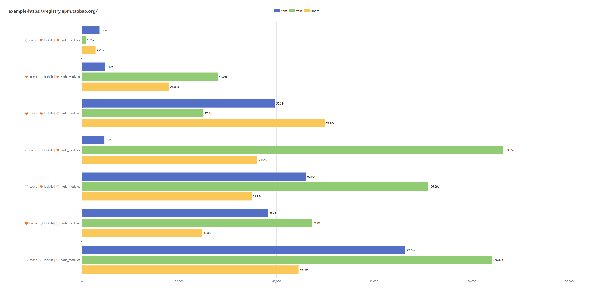
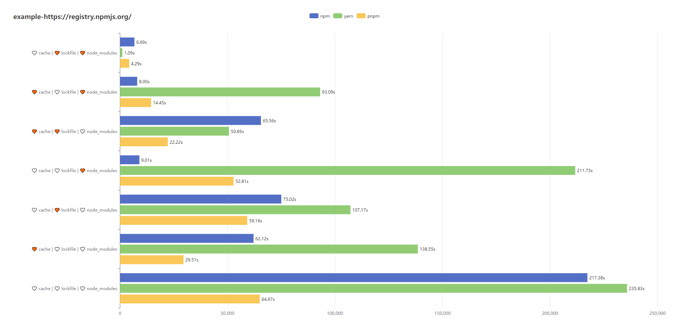

# 包管理器的抉择 - <附录> - 基准测试报告

## 测试指标

在测试结果中，我们主要关注包管理器的安装耗时，而对于磁盘占用的差距不做特别总结。因为在实际使用中，磁盘占用的差距很少会成为影响我们选择包管理器的重要因素。相反，安装耗时对于开发者和团队的效率和生产力影响更大。因此，在选择包管理器时，我们应该更注重安装耗时等实际使用体验。

|  command  | cache | lockfile | node_modules |
| :-------: | :---: | :------: | :----------: |
| `install` |       |          |              |
| `install` |   ✔   |    ✔     |      ✔       |
| `install` |   ✔   |          |              |
| `install` |       |    ✔     |              |
| `install` |       |          |      ✔       |
| `install` |   ✔   |    ✔     |              |
| `install` |   ✔   |          |      ✔       |
| `install` |       |    ✔     |      ✔       |

<!--
在日常开发中，常见的场景是增加、删除或更新依赖。

在进行这些操作之前，我们通常会假设项目中依赖相关的工件是完整的。而在自动化测试中，为了确保测试的准确性，我们需要进行全量安装一次（此次安装不会计入耗时统计），然后再对依赖进行修改，最后执行安装并统计耗时。

|  command  | cache | lockfile | node_modules |         note         |
| :-------: | :---: | :------: | :----------: | :------------------: |
| `install` |   ✔   |    ✔     |      ✔       | 保证工件完整（前提） |
| `dynamic` |  N/A  |   N/A    |     N/A      |  增删改依赖（版本）  |
 -->

## 参数设定

- `registry = https://registry.npmmirror.com/` 统一为国内镜像源
- `ignore-scripts = true` 忽略脚本的执行
- `auto-peer-deps  = true` 自动安装对等依赖
- `child-concurrency = 5` 限制并发构建`node_modules`的进程数
- `network-concurrency = 16` 限制下载依赖包时的并发请求数

## 机器环境

由于不同机器环境的差异，我们需要在不同的环境中测试，以验证包管理器的兼容性。但是，对于在同一台机器上测试的包管理器而言，它们是公平的，因为它们都在相同的硬件配置下运行。

本次测试没有进行多线程优化，因此唯一可能影响耗时统计的因素是网络环境。所以，请确保网络畅通，以确保测试的顺利进行。如果网络受阻，安装过程将不断重试，这将直接影响到耗时统计。

以下仅给出 Windows 与 Linux 环境的测试数据。

### Windows 11

### Windows 10 - WLS2 - Ubuntu 18.04.5

## 结论

实际上，不同机器环境的差异可能会对测试结果产生影响（一项优势在另一个系统中可能变为了劣势），因此很难对测试结果做出全面的总结。在这种情况下，我们需要考虑更多的是包管理器在其他方面的优劣，而不仅仅是安装时的性能。

而对于`Linux`系统而言，我们通常将其作为服务器或 CI 环境来承载项目的构建结果，包管理器的选择往往是在开发环境决定，生产环境保持同步即可。

为了提高测试结果的可靠性，并为选择合适的包管理器提供准确参考，我们需要着重针对最常用的`Windows`系统进行总结和共性抽象，以得出一些普遍适用的结论。

1. npm 专注于保证`node_modules`的完整性，只要符合 package.json 的声明，在测试用例中，安装速度通常在 10s 以内。
2. Yarn 以`lockfile`为主，`cache`为辅，作为 npm 的增强版，为了确保依赖结构的一致性，将优先考虑对`lockfile`文件的处理。而`cache`则相当于`node_modules`的离线压缩加密版，只要存在`cache`，结合`lockfile`就能快速地「重塑」`node_modules`。
3. Pnpm 更侧重`cache/store`，以确保同一个版本的依赖只存在一份，及其内容的完整性。因此，如果命中`cache`，其安装速度的瓶颈只受限于软硬链接的速度（在 Windows 下有兼容性问题，性能有损失）。
