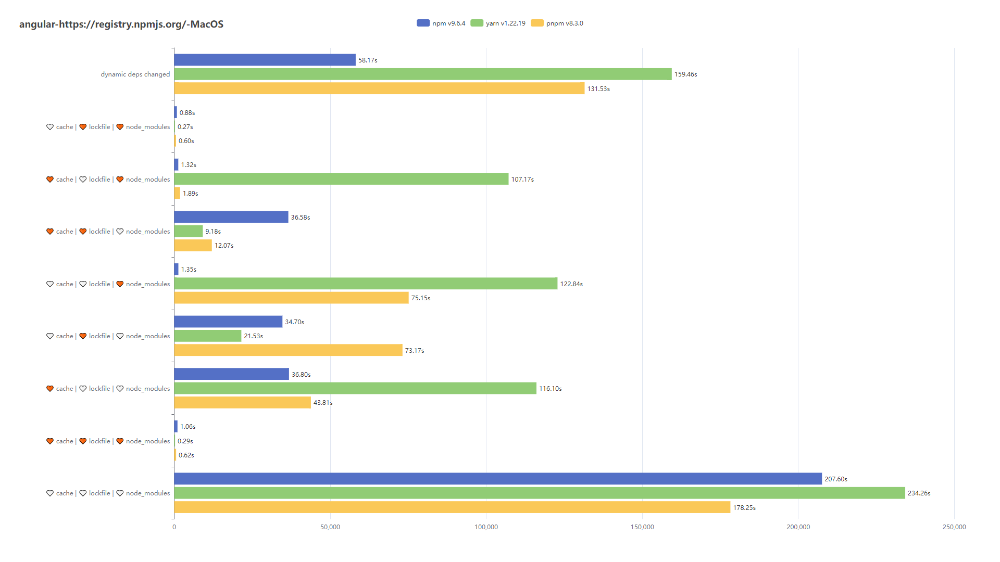
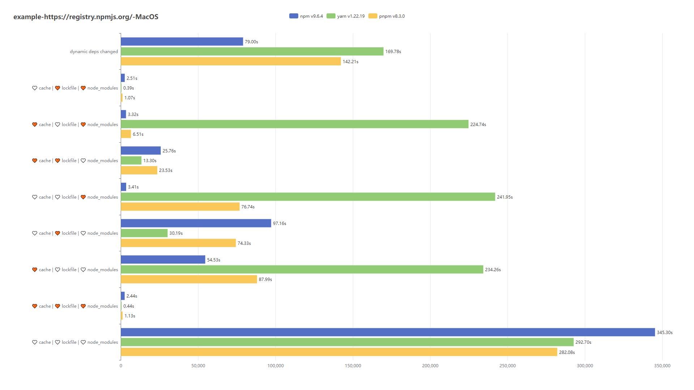
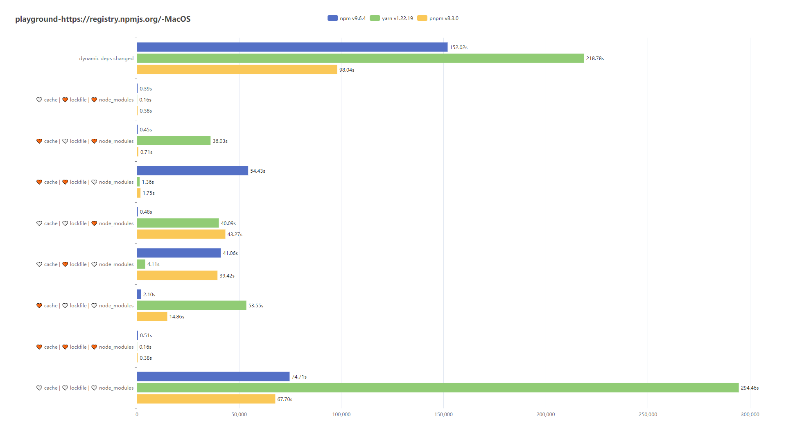
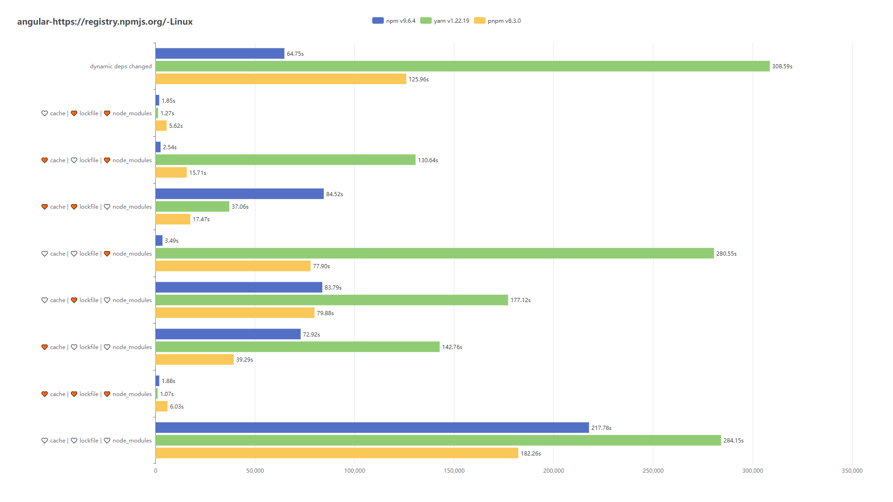
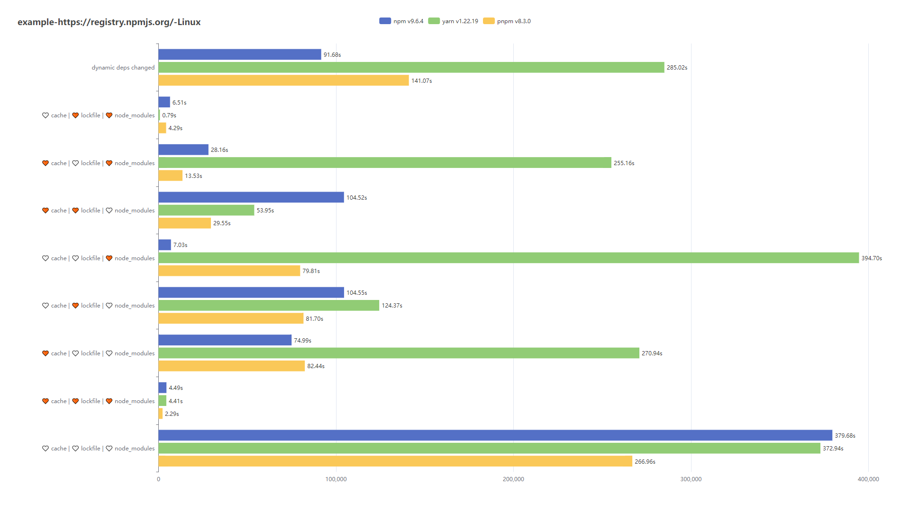
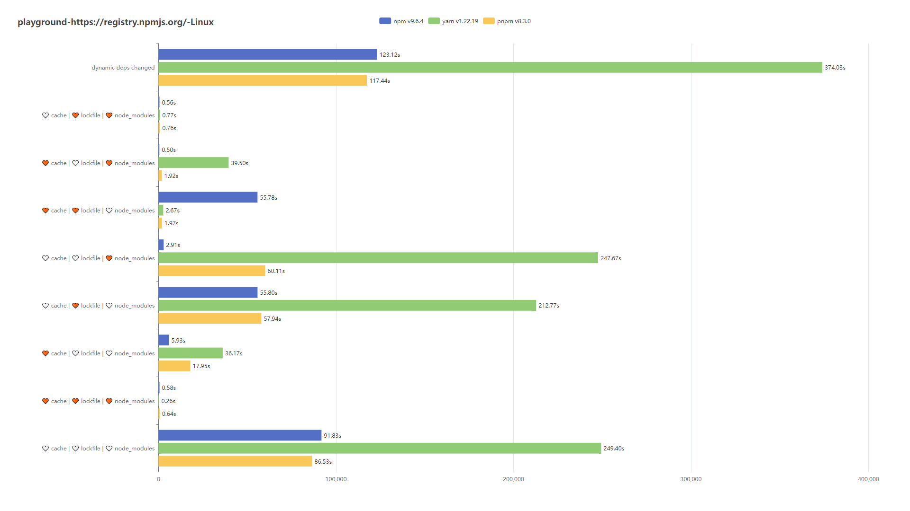

# 包管理器的抉择 - <附录> - 基准测试报告

## 测试指标

在测试结果中，我们主要关注包管理器的安装耗时，而对于磁盘占用的差距不做特别总结。因为在实际使用中，磁盘占用的差距很少会成为影响我们选择包管理器的重要因素。相反，安装耗时对于开发者和团队的效率和生产力影响更大。因此，在选择包管理器时，我们应该更注重安装耗时等实际使用体验。

> 若想了解磁盘占用，可查看各个文件下的`./specs/<env>/<project>/benchmark.json`记录

|  command  | cache | lockfile | node_modules |
| :-------: | :---: | :------: | :----------: |
| `install` |       |          |              |
| `install` |   ✔   |    ✔     |      ✔       |
| `install` |   ✔   |          |              |
| `install` |       |    ✔     |              |
| `install` |       |          |      ✔       |
| `install` |   ✔   |    ✔     |              |
| `install` |   ✔   |          |      ✔       |
| `install` |       |    ✔     |      ✔       |

在日常开发中，常见的场景是增加、删除或更新依赖。

在进行这些操作之前，我们通常会假设项目中依赖相关的工件是完整的。而在自动化测试中，为了确保测试的准确性，我们需要进行全量安装一次（此次安装不会计入耗时统计），然后再对依赖进行修改，最后执行安装并统计耗时。

|  command  | cache | lockfile | node_modules |         note         |
| :-------: | :---: | :------: | :----------: | :------------------: |
| `install` |   ✔   |    ✔     |      ✔       | 保证工件完整（前提） |
| `dynamic` |  N/A  |   N/A    |     N/A      |  增删改依赖（版本）  |

## 测试目标

我们需要对不同的项目进行测试，确保我们选择的包管理器能够满足实际项目的需求。

因为有些项目所使用的框架限定了包管理器，以此保证依赖引用关系的正确性。

实际项目：

- [一个玩具项目](./specs/playground-package.json)
- [一个 React 项目](./specs/example-package.json)
- [一个 Angular 项目](./specs/angular-package.json)

随机依赖项变更：

- [dynamic package changed](./specs/dynamic-package.json)

## 参数设定

- `ignore-scripts` 忽略脚本的执行
- `auto-peer-deps` 自动安装对等依赖
- `child-concurrency = 5` 限制构建`node_modules`的进程数
- `network-concurrency = 16` 限制下载依赖包时的并发请求数

## 机器环境

由于不同机器环境的差异，我们需要在不同的环境中测试，以验证包管理器的兼容性。但是，对于在同一台机器上测试的包管理器而言，它们是公平的，因为它们都在相同的硬件配置下运行。

本次测试没有进行多线程优化，因此唯一可能影响耗时统计的因素是网络环境。所以，请确保网络畅通，以确保测试的顺利进行。如果网络受阻，安装过程将不断重试，这将直接影响到耗时统计。

### MacOS

- Angular

  

- Example

  

- Playground

  

### Windows 11

### Windows 10 - WLS2 - Ubuntu 18.04.5

- Angular

  

- Example

  

- Playground

  

## 总结报告
