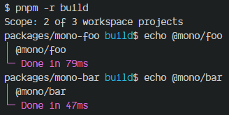
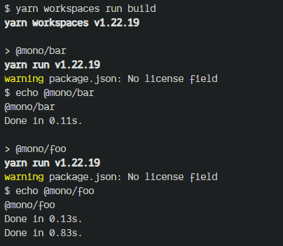

## 目录

- [包管理器的抉择](#包管理器的抉择)
  - [TL;DR](#tldr)
  - [主流包管理器](#主流包管理器)
  - [基准测试结果](#基准测试结果)
    - [基准测试参考与实现](#基准测试参考与实现)
    - [包管理器侧重点对比表](#包管理器侧重点对比表)
    - [附录](#附录)
  - [跨平台兼容性](#跨平台兼容性)
  - [项目管理策略](#项目管理策略)
    - [声明工作空间](#声明工作空间)
    - [链接本地依赖](#链接本地依赖)
      - [Pnpm workspace](#pnpm-workspace)
      - [Yarn \& npm](#yarn--npm)
    - [任务编排能力](#任务编排能力)
    - [小结](#小结)
  - [社区发展状况](#社区发展状况)
    - [Pnpm](#pnpm)
    - [Yarn](#yarn)
    - [npm](#npm)
  - [决策树](#决策树)

# 包管理器的抉择

本文将结合基准测试结果、跨平台兼容性、项目管理策略以及社区发展状况，提供一颗决策树，以帮助你在何时何地使用何种包管理器做出权衡。

## TL;DR

如果你已经熟悉了包管理器的基本概念，可以跳到本章节的结尾，参考[决策树](#决策树)的建议结果来选择合适的工具。

如果你想了解基准测试的结果，可以查看[附录](#附录)。

如果你对包管理器还不太了解，可以详细阅读本文，或查看各小节附带的对比表格，来更好地了解每个工具在不同领域的特点和优缺点。

## 主流包管理器


本次基准测试涉及的主流包管理器及其主版本为：

- npm v9
- Pnpm v8
- Yarn v1 `classic`

其中，Cnpm 由淘宝团队对 npm 进行了优化改造并提供了镜像源和缓存机制，而 Tnpm 则是在 Cnpm 的基础上进一步增强和定制，它们主要应用于企业私有化领域，所以并不算在主流范畴内。

> 相关资料：[Tnpm Rapid](https://zhuanlan.zhihu.com/p/455809528)

随着这几年的发展，Yarn 已经衍生出两个不同的版本：Yarn `classic`用来表明`v1`的版本，而 Yarn `berry`则用来表示`v2`及其以上的版本。

考虑到以下因素，我们仅测试`classic`版本：

- `classic`至今为止仍作为[默认版本](https://www.npmjs.com/package/yarn?activeTab=versions)被安装，对于一般开发者，`berry`的知晓率和使用率都相对较低。

  

- `berry`的架构设计与其它包管理器或是社区生态的发展方向有所不同（非贬义），尽管它也在努力兼容，但一些知名开源库考虑到兼容性问题还是会强制使用`classic`，比如 [Angular](https://github.com/angular/angular/blob/main/.yarn/README.md)。
- `berry`与 Pnpm 在特性/功能上有许多相通之处，同时两者的发展方向也正逐渐趋近。
- `berry`的启用过程配置略为繁琐，不利于进行通用的自动化测试。

基于上述原因，我们只需要对 Pnpm 进行测试即可涵盖对 Yarn `berry`的考虑。

|   pm   |                                  Week Downloads |
| :----: | ----------------------------------------------: |
| `npm`  |  [4,834,000](https://www.npmjs.com/package/npm) |
| `Pnpm` | [4,110,760](https://www.npmjs.com/package/pnpm) |
| `Yarn` | [3,787,511](https://www.npmjs.com/package/yarn) |

> 如果你想了解 Yarn `berry`的基准测试结果，可以参考下文中 Yarn 与 Pnpm 的官方基准测试，或是对自动化测试项目的源代码进行修改以进行测试。

## 基准测试结果

### 基准测试参考与实现

将 Yarn 与 Pnpm 的官方基准测试结果作为参考：

- [https://pnpm.io/benchmarks](https://pnpm.io/benchmarks)
  - [benchmark script](https://github.com/pnpm/pnpm.github.io/tree/main/benchmarks)
- [https://yarnpkg.com/benchmarks](https://yarnpkg.com/benchmarks)
  - [benchmark script](https://github.com/yarnpkg/berry/blob/master/scripts/bench-run.sh) - 该基准测试仅在`Linux`环境下进行

自行实现的自动化测试项目参考了官方的测试脚本并经过优化，使其具备跨平台测试的能力，且更具有扩展性：[control-variates](https://github.com/zhenzhenChange/control-variates)。

> 鉴于篇幅限制，你可以在[附录](#附录)中查看更详细的基准测试结果。

### 包管理器侧重点对比表

根据基准测试结果得出的包管理器侧重点对比表：

|   pm   | cache  | lockfile | node_modules |
| :----: | :----: | :------: | :----------: |
| `npm`  |        |          |    💥💥💥    |
| `Yarn` |        |  💥💥💥  |              |
| `Pnpm` | 💥💥💥 |          |              |

其中：

- npm 主要关注`node_modules`的可用性，只要所需依赖能被正确安装即可
- Yarn 更注重维持`lockfile`的一致性，确保在不同环境或多次安装时能获得一致的依赖结构
- Pnpm 则更强调充分利用`cache`以提高安装效率，减少磁盘的占用，同时解决依赖污染等问题

### 附录

[基准测试详细报告](./infra-link-pm-benchmarks.md)

## 跨平台兼容性

除了 Pnpm 之外，其它两个主流包管理器在跨平台兼容性方面表现出色。

Pnpm 在安装依赖时采用软硬链接方式将依赖项从全局存储库链接到项目中。而在`Windows`环境下，由于软链接存在一定的兼容性问题，Pnpm 采用了其它[解决方案](https://pnpm.io/faq#does-it-work-on-windows)替代。

因此，就`Windows`环境而言，使用 Pnpm 安装依赖的性能有可能不如 Yarn，甚至更差（取决于机器的硬件性能）。

> 在极端情况下，还可能会导致`Windows`操作系统卡死崩溃，目前还无法知晓问题的确切原因（Pnpm 作者也不确定 🤣），感兴趣请追踪：<https://github.com/pnpm/pnpm/issues/6298>

|   pm   | Linux | MacOS | Windows |
| :----: | :---: | :---: | :-----: |
| `npm`  |  🤩   |  🤩   |   🤩    |
| `Yarn` |  🤩   |  🤩   |   🤩    |
| `Pnpm` |  🤩   |  🤩   | 🤡🤡🤡  |

## 项目管理策略

当前，越来越多的项目开始采用 monorepo 作为项目管理策略，这也意味着越来越多的开发者开始重视模块化开发的思维模式。

在 monorepo 模式下：

1. 有效管理各模块之间的依赖关系至关重要，这项工作由包管理器来处理。
2. 同时还需要一个版本发布系统来协同工作，以帮助解决项目开发、构建、测试和部署等任务。

两种工具的协同使用可以更好地提高项目的迭代效率。


> 如果某个模块不适合被升级为一个独立的依赖包，其实我们只需要采用别名映射与构建工具结合的方式，直接替换引用路径来进行管理。或是整个项目升级为 monorepo 模式，使用包管理器的链接功能完成依赖引用。
>
> 这些方法本质上还是一种模块化的思想，只是采用了不同的管理策略，更多内容将在[此处](./infra-link-modular.md)探讨。
>
> 扩展阅读：[如何评价 Turborepo 这个 Monorepo 解决方案？](https://www.zhihu.com/question/505956571)

我们已经在前文详细介绍了几个主流包管理器在依赖安装时的性能对比，因此接下来我们将着重比较它们在 monorepo 模式下其它方面的表现。

### 声明工作空间

```jsonc
// npm - package.json
{
  "workspaces": ["packages/*"]
}
```

```jsonc
// Yarn - package.json
{
  "workspaces": ["packages/*"]
}
```

```yaml
# Pnpm - pnpm-workspace.yaml
packages:
  - packages/*
```

相对而言，Pnpm 以更加轻量化的方式实现了工作空间的定义：将其独立成一份单独的`pnpm-workspace.yaml`配置文件。

这种分离方式不仅提升了未来添加自定义属性的灵活性，同时也能避免`package.json`文件功能的过度膨胀和不单一问题。

### 链接本地依赖

#### [Pnpm workspace](https://pnpm.io/workspaces)

```tree
monorepo
├─ packages
│    ├─ mono-bar
│    │    └─ package.json
│    └─ mono-foo
│           └─ package.json
├─ package.json
├─ pnpm-lock.yaml
└─ pnpm-workspace.yaml
```

Pnpm 实现了一项名为`workspace protocol`（以下简称`workspace:`）的功能，该功能可以优先搜索本地已存在的`package`，以便在安装依赖时进行优化。

具体来说，使用 Pnpm 为某个子包添加依赖时会触发以下逻辑：

```shell
pnpm -F @mono/bar add @mono/foo
```

1. 如果本地存在子包`@mono/foo`，则将其直接链接到子包`@mono/bar`中，并自动添加`workspace:`前缀标注（当然，你也可以手动声明之后执行依赖安装）：

   ```json
   {
     "name": "@mono/bar",
     "dependencies": {
       "@mono/foo": "workspace:^"
     }
   }
   ```

2. 如果本地不存在依赖包`@mono/foo`，Pnpm 会从镜像站检索该包，如果检索成功，则会安装该依赖包，但这有可能不是你想要的（你需要的是本地的其它子包）。

使用`workspace:`可以确保你只安装本地的依赖包，避免错误的发生，这样做可以帮助你提前发现问题。

#### Yarn & npm

而 Yarn 和 npm 需要做更多的工作。

1. 手动声明依赖关系，在安装过程中检索并自动链接（与上文的逻辑 2 如出一辙）

   ```json
   {
     "name": "@mono/bar",
     "dependencies": {
       "@mono/foo": "1.0.0"
     }
   }
   ```

2. 手动执行链接操作

   ```shell
   # 在 @mono/foo 执行链接命令（此命令会将该包链接至磁盘全局而不是项目的根目录）
   yarn link
   ```

   ```shell
   # 在 @mono/bar 执行链接命令（将 @mono/foo 从全局链接至此）
   yarn link @mono/foo
   ```

3. 借助第三方工具，如 Lerna。

   ```shell
   lerna add @mono/foo --scope=@mono/bar
   ```

### 任务编排能力

在一个 monorepo 仓库中，通常有许多子包，这些子包之间可能存在依赖关系。如何根据子包之间的依赖关系进行拓扑排序，并按照正确的顺序执行任务至关重要。

例如，在前文中，`@mono/bar`依赖`@mono/foo`，则需要先执行`@mono/foo`的`build`任务。

Pnpm 则支持了一定的任务编排能力。

```shell
# -r -> 所有包含 build 命令的 package 都会被执行
pnpm -r build

# -F -> 部分 package
pnpm -F ..@mono/foo     # 执行依赖 @mono/foo 的包
pnpm -F ..@mono/foo..   # 执行依赖 @mono/foo 和被 @mono/foo 依赖的包
pnpm -F @mono/foo..     # 执行被 @mono/foo 依赖的包
```



但貌似 Yarn 和 npm 并不支持拓扑排序。

```shell
yarn workspaces run build
```



当然，随着 monorepo 项目的不断扩大和复杂化，可能需要更多的功能，如并行任务、构建缓存、智能任务调度等。在这种情况下，可能需要借助第三方工具，如使用 Lerna、Nx、Rush、TurboRepo 等来支持这些需求。这些工具提供了更高级的功能和更好的扩展性，能够更好地管理大型 monorepo 项目。

### 小结

相比之下，`Pnpm`的使用体验更加出色，功能集成度更高，毕竟它也借鉴了很多前人的经验。

|   pm   | Workspace | Linking | Topology |
| :----: | :-------: | :-----: | :------: |
| `npm`  |    🤩     |   🤩    |    ❌    |
| `Yarn` |    🤩     |   🤩    |    ❌    |
| `Pnpm` |  🤩🤩🤩   | 🤩🤩🤩  |    ✔     |

本节主要关注依赖管理方面的内容，而完整的 monorepo 模式通常还需要一个发布系统。不过由于发布系统不在包管理器所涵盖的范围内，因此本文不再深入。


## 社区发展状况

### Pnpm

Pnpm 爆火的原因主要有两个：

- 对依赖处理方式的不同，在一定程度上解决了一些依赖问题；
- 同时内置了适用于 monorepo 的特定功能，而 yarn & npm 则对此支持的程度不够，往往需要结合其它工具使用，增加了维护复杂度。

So，Pnpm 在 monorepo 中的使用体验更加顺畅。

### Yarn

Yarn 的`classic`版本已不再开发新功能，主要的开发精力已经转移到了`berry`版本上。不过，对于一般的项目而言，使用 Yarn 去管理依赖仍然是一个不错的选择，因为它提供了稳定的依赖管理功能，并且社区和文档方面也比较成熟和完善。

### npm

如今，npm 已经沦为了安装其他包管理器的管理器，甚至官方也在计划“放弃”它，转而维护一个真正意义上的“包管理器的管理器”，即 corepack。这是因为 npm 在一些方面存在一些问题，如安装速度较慢、依赖管理不够稳定等，导致它逐渐失去了一部分用户的信任。因此，corepack 的推出也意味着官方对于包管理器的管理和发展方向的重新思考。

> [废宅阿斗 NPM 即将被 Node.js 官方抛弃 → Corepack](https://zhuanlan.zhihu.com/p/408122100)

## 决策树

> 一切选择皆为权衡（Trade-off）。

1. 关于应用类型
   1. 如果应用所用的框架自身限定了包管理器，建议跟随其至
   2. 否则，进入下一步
2. 关于系统环境
   1. 如果系统是 Windows 并且硬件配置较低，建议使用 Yarn
   2. 否则，进入下一步
3. 关于项目迭代
   1. 如果有严重的历史包袱，建议使用 Yarn 或维持现状
   2. 否则，进入下一步
4. 关于项目类型
   1. 如果项目是 monorepo 项目，强烈建议使用 Pnpm
   2. 否则，如果项目是传统项目，推荐使用 Pnpm，其次是 Yarn
5. 关于项目规模
   1. 如果项目规模较大，需要对依赖优化时，推荐考虑 Pnpm
   2. 否则，推荐 Yarn 或维持现状

---

npm：我呢我呢？那我呢？


